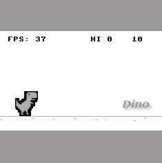
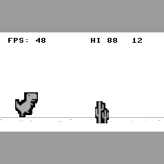
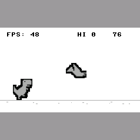
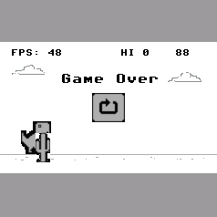
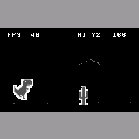
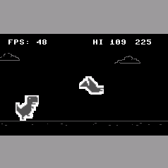
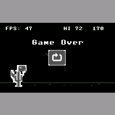

# Dino

This project reimplements the Google Chrome Dino Game. It is based on LovyanGFX driver and further will be migrated to ESP32-S3 board. The `win` branch is used for cross compile that can generate executable program running on Windows.

**Dino can get special skills if you help it reach high scores!**

## Dino Game Demo

<div class="dino" align="center">


<font size="2" color="#999"><u>Dino Game</u></font>
</div>

- **Quick Drop:** If Dino gets 1000 scores, it can obtain the ability to quick drop from the air. (&darr;)
- **Double Jump:** If Dino gets 2500 scores, it can obtain the ability to make another jump in the air. (&uarr;)

You can use arrow key &uarr; to jump, &darr; to bend over. &rarr; will be used to restart game if Dino has dead.

## Dino Game: On day

<div class="dino" align="center">
  <table>
    <tr>
      <td>
      <td>
      <td>
    </tr>
    <tr>
      <td align="center"><font size="2" color="#999"><u>Cactus</u></font></td>
      <td align="center"><font size="2" color="#999"><u>Bird</u></font></td>
      <td align="center"><font size="2" color="#999"><u>Dino Game Over</u></font></td>
    </tr>
  </table>
</div>

## Dino Game: On night

<div class="dino" align="center">
  <table>
    <tr>
      <td>
      <td>
      <td>
    </tr>
    <tr>
      <td align="center"><font size="2" color="#999"><u>Cactus</u></font></td>
      <td align="center"><font size="2" color="#999"><u>Bird</u></font></td>
      <td align="center"><font size="2" color="#999"><u>Dino Game Over</u></font></td>
    </tr>
  </table>
</div>

> This project use some materials from [AquaCoder0010/Dino-Game-SFML](https://github.com/AquaCoder0010/Dino-Game-SFML).

## Prerequisite

- Ubuntu 20.04 or higher
- CMake
- Clang or GNU build toolchain

## Cross Compile For Win

- First clone this repository and pull the contained submodules.

    ```bash
    git clone -b win https://github.com/HangX-Ma/dino.git
    cd dino && git submodule update --init --recursive
    ```

- Change `library/LovyanGFX/src/lgfx/v1/platforms/sdl/common.cpp` included `<thread>` to `"mingw.thread.h"`.

- Install `mingw` component.

    ```bash
    sudo apt-get update
    sudo apt-get install mingw-w64-x86-64-dev
    sudo apt-get install mingw-w64-tools
    ```

- Download [SDL2-devel-2.28.5-mingw.tar.gz](https://github.com/libsdl-org/SDL/releases/tag/release-2.28.5) to your **HOME** and compile it. If `make cross` fails, you need to change `CROSS_PATH` in `Makefile` to `/usr`

    ```bash
    tar -xvf SDL2-devel-2.28.5-mingw.tar.gz
    cd SDL2-2.28.5 && make cross
    ```

- After all above steps done, you can compile dino now!

    ```bash
    cd dino
    cmake -B build_mingw
    cmake --build build_mingw -j$(nproc)
    ```

- Last but not least, you need to pack the output file `build_mingw/dino.exe` with `${HOME}/SDL2-2.28.5/x86_64-w64-mingw32/bin/SDL2.dll`. Otherwise, the program will complain it can not find `SDL2.dll` when you try to run it on Windows platform.

## Third Party Library and Tools

- [lovyan03/LovyanGFX](https://github.com/lovyan03/LovyanGFX)
- [meganz/mingw-std-threads](https://github.com/meganz/mingw-std-threads)
- [libsdl-org/SDL: SDL2-devel-2.28.5-mingw](https://github.com/libsdl-org/SDL/releases/tag/release-2.28.5)
- [riuson/lcd-image-converter](https://github.com/riuson/lcd-image-converter)
- [TAAG: Text to ASCII Art Generator](https://patorjk.com/software/taag/#p=display&f=Graffiti&t=Type%20Something%20)

## License

MIT License
